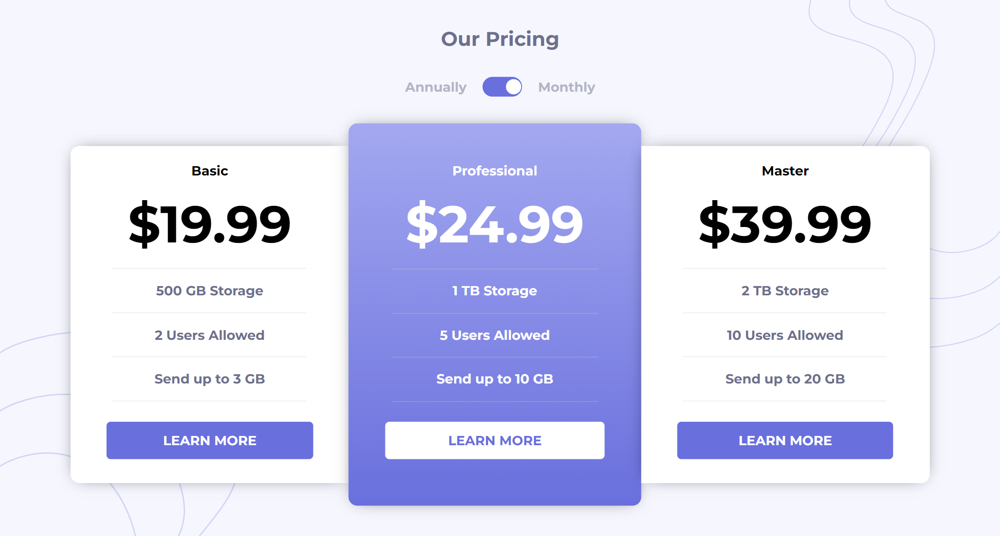

# <h1 align="center">Frontend Mentor - Pricing component with toggle solution</h1>



Essa é a solução para o desafio [Pricing component with toggle challenge do Frontend Mentor](). Os desafios do [Frontend Mentor](https://www.frontendmentor.io/challenges/pricing-component-with-toggle-8vPwRMIC) ajudam a melhorar habilidades de codificação através da construção de projetos realistas.


## Índice

- [Visão geral](#visão-geral)
    - [O desafio](#o-desafio)
    - [Links](#links)
- [Meu processo](#meu-processo)
    - [Construído com](#construído-com)
    - [O que aprendi](#o-que-aprendi)
    - [Desenvolvimento contínuo](#desenvolvimento-contínuo)
- [Autor](#autor)
- [Agradecimentos](#agradecimentos)

## Visão geral
### O desafio
Os usuários são capazes de:

- Layout Responsivo;
- Estado de foco;
- Elementos Interativo;

### Links
- [Soluçao]()
- [Repositório do GitHub](https://github.com/tatyanepgoncalves/Pricing-Component)


## Meu processo 
### Construído com 

- HTML5
- SASS
- JS

### O que aprendi

```js 
    const button = document.getElementById("trilho");
    button.addEventListener("click", showValue);

    function showValue() {
        const monthPayment = document.getElementsByTagName("h3");
        const annualPayment = document.getElementsByTagName("h4");
        var i;
        var n;

        for (i = 0; i < monthPayment.length; i++) {
            for(n = 0; n < annualPayment.length; n++) {
                if (monthPayment[i].style.display === "none") {
                    monthPayment[i].style.display = "block";
                    annualPayment[i].style.display = "none";
                    button.style.justifyContent = "flex-end";
                } else {
                    monthPayment[i].style.display = "none";
                    annualPayment[i].style.display = "block";
                    button.style.justifyContent = "flex-start";
                }
            }
        }
    }
```

### Desenvolvimento contínuo

Nesse projeto pode colocar em prática com mais facilidades os conceitos de `responsividade` e `SASS`. Além de praticar `JS`.

### Autor
- Frontend Mentor - [@tatyanepgoncalves](https://www.frontendmentor.io/profile/tatyanepgoncalves)
- LinkedIn - [@tatyanegoncalves](https://www.linkedin.com/in/tatyanegoncalves/)